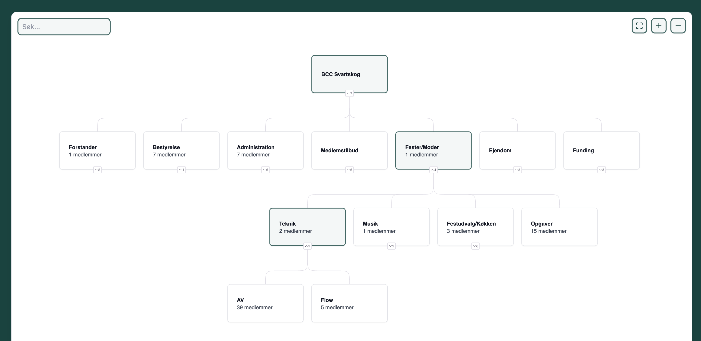

# Local Church Org Diagram

Self-hosted solution for creating interactive organization diagram for local churches in BCC.

&check; Secured with BCC-login (local church-internal)

&check; GDPR-compliant

**NOTICE!** This project is owned by BCC København and is supplied under a fair-use policy for BCC-purposes only.
Please get in touch with one of the [maintainers](https://github.com/bcc-code/local-church-org-diagram/graphs/contributors) if you're considering using it in your local church.

## Features



* Interactive org diagram with group hierarchy per church
* Click on group to show list of group members
* Admins can add/remove members through a special admin page
* The group hierarchy itself is maintained in the database directly or imported ([ie. from Excel](./tools/import_from_excel.ipynb))

## Overview

This project contains a Vue.js frontend (TypeScript) and a Flask backend (Python):

- `frontend/` — Vue.js 3 + TypeScript app (Vite)
- `backend/` — Flask app

The org diagram is a D3-based interactive diagram.

Data on group hierarchy and group memberships is stored in Supabase.

Member data is pulled from [BCC Core API](https://developer.bcc.no/bcc-core-api/) and cached in-memory.

## Getting Started

### Frontend

1. Install dependencies:
   ```sh
   cd frontend
   npm install
   ```
2. Run the development server:
   ```sh
   npm run dev
   ```

### Backend

1. Install dependencies:
   ```sh
   pip install -r requirements.txt
   ```
2. Run the Flask server:
   ```sh
   cd backend
   flask run
   ```

## Demo Mode

Set the environment variable `DEMO_MODE=1` to enable demo mode in the backend Flask app.
Configure it in your `.env` file or in the terminal session as shown below.
When enabled, all API endpoints (except `/`) will return static JSON responses from files in the `backend/demo_requests/` directory, matching the request path (e.g., `/tree` returns `demo_requests/tree.json`).

**Usage:**

```sh
export DEMO_MODE=1
flask run
```

This is useful for development and testing without requiring live backend or external API access.
